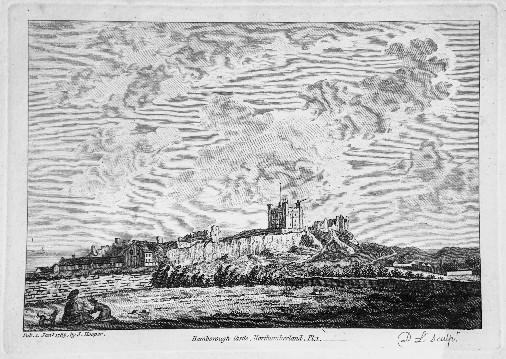

  
   

#### About
Hi, I'm Tom - I'm a researcher at BlackRock with previous experience as an ML Research Engineer at Open Climate Fix and as Quant Trader at DRW. I am interested in signal processing, meterology, finance, network science, ecology and lastly machine learning - in both the generic sense and in application to the previous topics. I grew up in Newcastle Upon Tyne and currently live in London.